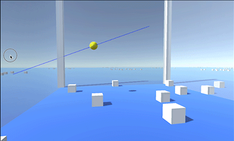
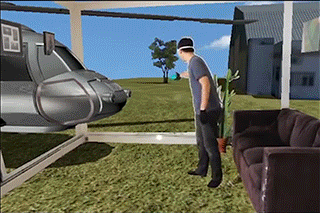

Clicky Draggy
=========

A proof of concept for a Vive navigation system.  Currently mouse controlled, but will port to actual Vive controllers when I have a chance.

Instructions:
--------

1. Press Play
2. Move mouse around on screen to change where the line is going
3. Click and drag to move the scene around based on where the line hits the ground of the scene

Based on design patterns from [Spatial Computing](http://albert-hwang.com/projects/spatial-computing/):

I am interested in building out an OOP-ier version where the thing you want to manipulate (the environment) would be thrown in an empty that had a `is-navigatable` component on it.  Also, a more comprehensive abstraction of "focal point" and some sort of article or video explaining the concept.
